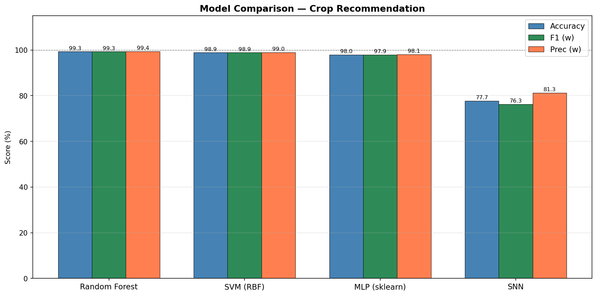
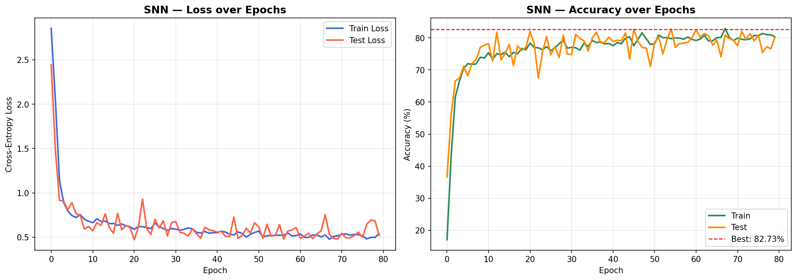
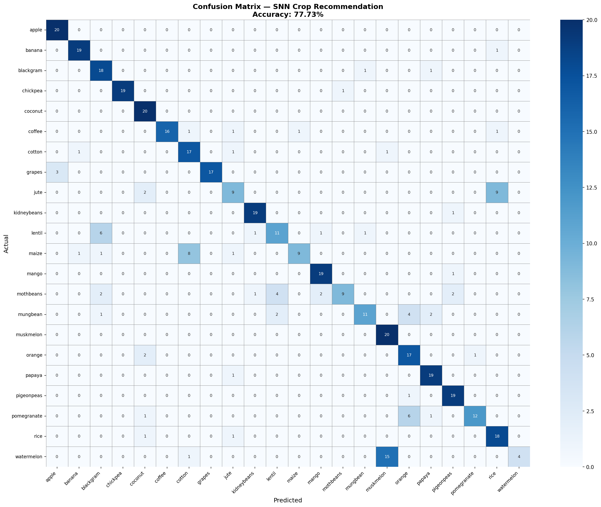
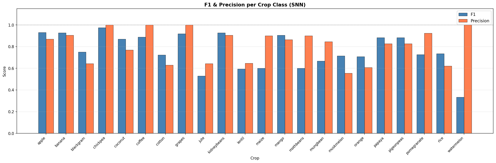
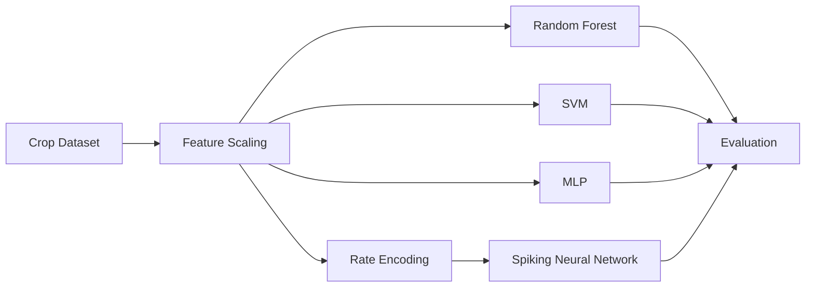

# Neuromorphic Crop Recommendation with Spiking Neural Networks

<p align="center">
  <strong>Neuromorphic AI for crop recommendation using SNNs and classical machine-learning baselines</strong>
</p>

<p align="center">
  
  
  
  <a href="https://github.com/shaiksadik1725-droid/Neuromorphic_SNN/actions/workflows/python-syntax.yml"></a>
</p>

## Project at a Glance

| Item | Details |
|---|---|
| Domain | AI for agriculture |
| Research focus | Spiking Neural Networks |
| Inputs | N, P, K, temperature, humidity, pH, rainfall |
| Baselines | Random Forest, SVM, MLP |
| Interface | Python training pipeline + Flask application |
| Status | Academic / research prototype |

## Overview

The system recommends crops from agricultural and environmental measurements while comparing a **Spiking Neural Network (SNN)** against conventional machine-learning models. The project explores whether neuromorphic methods can be applied to a practical classification task.

## Results & Visual Evidence

<p align="center">
  
  
</p>

<p align="center">
  
  
</p>

## Model Pipeline



## SNN Design

The SNN uses rate-encoded spike trains and multiple leaky integrate-and-fire layers implemented with **snnTorch**. The training pipeline also saves model artifacts and evaluation plots for later inference and comparison.

## Technology Stack

- Python
- PyTorch
- snnTorch
- scikit-learn
- Pandas
- NumPy
- Matplotlib
- Seaborn
- Flask

## Repository Structure

```text
Neuromorphic_SNN/
├── train.py
├── app.py
├── model_utils.py
├── requirements.txt
├── dataset/
├── crop_snn_best.pth
├── rf_model.pkl
├── scaler.pkl
├── label_encoder.pkl
├── model_config.pkl
├── training_curves.png
├── confusion_matrix.png
├── model_comparison.png
└── f1_precision_per_class.png
```

## Setup

```bash
git clone https://github.com/shaiksadik1725-droid/Neuromorphic_SNN.git
cd Neuromorphic_SNN
pip install -r requirements.txt
python train.py
```

## Research Value

The repository does more than train one classifier: it places a neuromorphic model beside conventional baselines and preserves evaluation artifacts for comparison.

## Future Work

- Benchmark latency and energy use on neuromorphic hardware
- Expand cross-validation and hyperparameter studies
- Add more soil and weather variables
- Add model explainability
- Deploy inference to edge hardware
- Add automated reproducibility checks

## Author

**Sadik Shaik**

Computer Engineering · Artificial Intelligence · Embedded Systems
